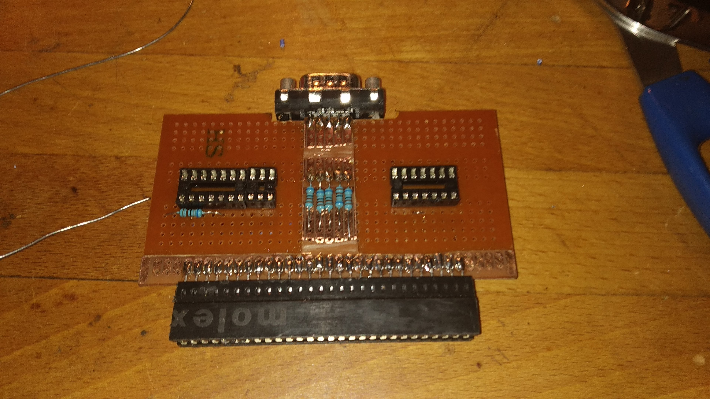

# kempston-joy-interface

## Notes
Some quick notes about a ZX Spectrum Kempston joystick interface project I've been working on some months ago.. 
Not very polished nor professional, but working perfectly.
I'm not providing a lot of details, this is just some sort of logbook to retain some history.
It could anyway be of some use for anyone willing to build a similar object.

I based the project on this good schematic:
https://8bit.yarek.pl/hardware/zx.joystick/index.html

As a personal challenge, I tried to use the minimum amount of materials (and also, the cheapest) to build it, trying to recycle & adapt what I already had handy, whenever possible.
What I used:

* Joystick connector: DB9 Male
* Edge connector: obtained from an old PC motherboard ISA connector (cut to correct size, "insertion key" obtained plying together and soldering the 2 relevant connector plates)
* PCB: used 2 cheap prototype PCB breadboards like [these](https://www.amazon.it/Bluelover-5X10Cm-Singolo-Prototipo-Breadboard/dp/B074HFCW9V/). One is cut in a "T", filed to remove unwanted connections, and glued together with the other underlying, unmodified one (see pic for inspiration), in order to
	* match the correct thickness to solder connectors
	* provide dual side traces
	* simplify connections
* 8 x pullup resistors (6 Kohm)
* 1 x 74LS240 (Octal inverter, Line Driver, Tri-State)
* 1 x 74LS32 (Quad 2-input OR Gate)

## Schematics
*Component side*

*Solder side*

## Board build
*Preliminary*

*Complete*

Note: some final wiring corrections drove me to ugly routing.. you can surely do better than me :-)